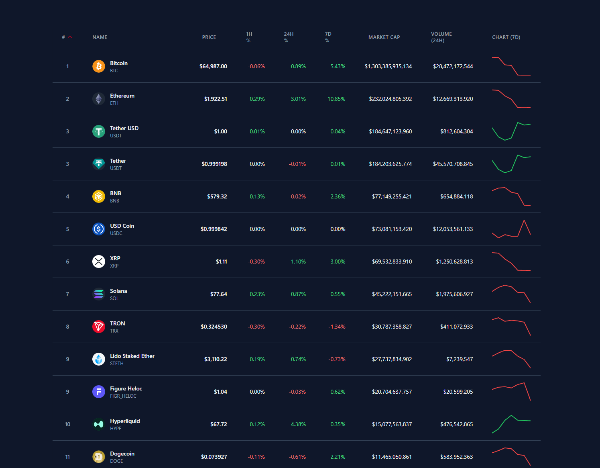
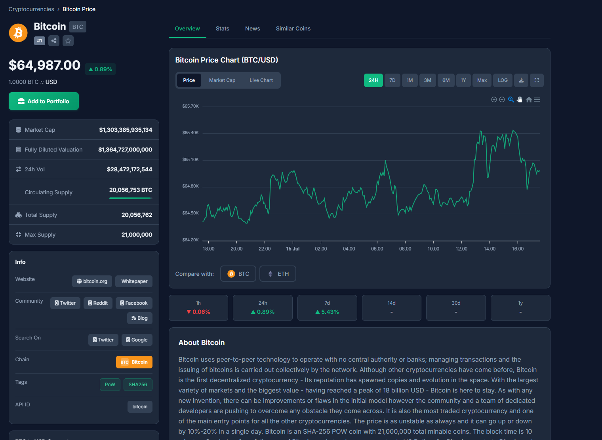

# 💹 WhiteLabel Crypto Market Platform

### Launch your own professional cryptocurrency tracking platform.

**Complete Website + Admin Panel + Portfolio + News + API**

🚀 Production Ready • White Label • Fully Scalable

📩 **Telegram:** https://t.me/edwardgarciaa

---

  

# 🚀 Overview

Build your own modern cryptocurrency platform similar to CoinMarketCap or CoinGecko under your own brand.

This is a complete **White Label Crypto Market Platform** featuring real-time market data, portfolio management, price alerts, AI-powered news, exchange rankings, subscription plans, developer APIs, and a powerful admin panel.

Everything can be fully customized with your own logo, colors, domain, and branding.

---

# 📈 Market Data

Powered by CoinGecko API.

Features include:

- Real-Time Prices
- 2,500+ Cryptocurrencies
- Live Market Cap
- Trading Volume
- Price Changes
- Trending Coins
- Global Market Statistics
- Historical Data

---

# 📊 Interactive Charts

Professional TradingView-style charts.

Supported timeframes:

- 1 Hour
- 24 Hours
- 7 Days
- 30 Days
- 1 Year
- All Time

Available chart types:

- Candlestick
- Line Chart

---

# 💼 Portfolio Management

Users can manage multiple portfolios.

Features:

- Unlimited Portfolios
- Buy / Sell Transactions
- Average Buy Price
- Profit & Loss Tracking
- Asset Allocation
- Portfolio Charts
- CSV Export
- Transaction History

---

# 🔔 Price Alerts

Create custom alerts based on:

- Target Price
- Percentage Change
- One-Time Alerts
- Recurring Alerts

Notifications via Email.

---

# ⭐ Watchlist

- Favorite Coins
- Drag & Drop Sorting
- Live Price Updates
- Quick Portfolio Access

---

# 🏦 Exchange Rankings

Browse over **500+ cryptocurrency exchanges**.

Includes:

- Trust Scores
- Trading Volume
- Supported Trading Pairs
- Exchange Information

---

# 🌍 Blockchain Ecosystems

Explore blockchain networks.

Includes:

- Chains
- Ecosystem Tokens
- Projects
- Explorer Pages

---

# 💱 Crypto Converter

Instant conversion between:

- Crypto → Crypto
- Crypto → Fiat
- Fiat → Crypto

Supports 50+ currencies.

---

# 📰 News & Blog

Built-in news platform.

Features:

- AI Generated News
- Multiple News Sources
- Blog System
- Categories
- Featured Articles
- SEO Ready

---

# 😨 Fear & Greed Index

Track market sentiment with:

- Daily Updates
- Historical Values
- Charts
- Trend Analysis

---

# 📚 Crypto Dictionary

Searchable crypto glossary featuring:

- A–Z Navigation
- Hundreds of Terms
- Beginner Friendly

---

# 📅 Events Calendar

Stay updated with:

- Token Launches
- Airdrops
- Community Events
- Calendar View

---

# 👛 Wallet Directory

Browse crypto wallets with:

- Platform Support
- Security Ratings
- Features
- Supported Chains

---

# 🧩 Embeddable Widgets

Generate widgets for any website.

Available widgets:

- Price Ticker
- Coin Tables
- Market Charts
- Currency Converter

---

# 💳 Buy / Sell Integration

Redirect users to supported exchanges for instant crypto purchases.

---

# 👨‍💻 Developer API

REST API Included.

Features:

- API Key Management
- Rate Limiting
- Usage Analytics
- API Documentation

Example snippets:

- cURL
- JavaScript
- Python
- PHP

---

# 💎 Subscription Plans

Supports:

- Free
- Premium
- Pro

Features include:

- Feature Restrictions
- Promo Codes
- Trial Periods
- Subscription Management

---

# 🤝 Affiliate Program

Included:

- Referral Tracking
- Commission Management
- Automatic Payout Tracking
- Performance Reports

---

# 📧 Newsletter

Manage subscribers with:

- Email Campaigns
- Premium Content
- SMTP Integration

---

# 🌐 Multi Language

Supports 15+ languages.

Examples:

- English
- Spanish
- French
- German
- Arabic
- Chinese
- Japanese

RTL Supported.

---

# 💱 Multi Currency

Supports over **50 currencies**.

Examples:

- USD
- EUR
- GBP
- TRY
- BTC
- ETH

---

# 🔍 SEO Optimized

Built for search engines.

Includes:

- XML Sitemap
- Meta Tags
- Open Graph
- Twitter Cards
- JSON-LD
- Structured Data

---

# 🔐 Security

Features:

- Two-Factor Authentication (2FA)
- Google Login
- Facebook Login
- GitHub Login
- reCAPTCHA
- Account Lockout Protection

---

# 🌙 UI & Experience

- Dark Mode
- Light Mode
- Mobile Responsive
- Fast Performance
- Modern Design

---

# 💻 Admin Panel

## Dashboard

- Revenue Analytics
- User Statistics
- Coin Statistics
- Subscribers
- API Usage
- Traffic Overview

---

## User Management

- Users
- Roles & Permissions
- Social Login
- 2FA Management
- Account Status

---

## Content Management

Manage:

- Pages
- Blog
- Categories
- SEO Metadata
- News

---

## Subscription Management

- Plans
- Payments
- Coupons
- Trials
- Billing

---

## API Management

- API Keys
- Usage Limits
- Rate Limiting
- Analytics
- Logs

---

## Newsletter

- Subscribers
- Campaigns
- SMTP
- Templates

---

## Site Settings

Configure:

- Branding
- Logo
- Favicon
- SMTP
- SEO
- Social Links
- Analytics

---

# 💳 Payment Gateways

Supports **20+ Payment Gateways**.

Examples:

- Stripe
- PayPal
- Paddle
- Coinbase Commerce
- Razorpay
- Flutterwave
- Mollie

---

# 🛠 Tech Stack

Backend

- Laravel

Admin Panel

- Filament 3.x

Frontend

- Blade + Livewire

Database

- MySQL

API

- CoinGecko API

---

# 📦 Includes

✅ Complete Website

✅ Admin Dashboard

✅ Source Code

✅ Documentation

✅ REST API

✅ White Label License

---

# 🎨 White Label

Everything can be customized.

- Logo
- Brand Name
- Colors
- Domain
- Homepage
- Email Templates
- SEO
- Theme

No vendor branding.

---

# ⭐ Why Choose This Platform?

- Production Ready
- White Label
- 2,500+ Live Coins
- TradingView Charts
- Portfolio Tracking
- AI News
- API Included
- Multi Language
- Multi Currency
- Subscription System
- SEO Optimized
- Mobile Responsive
- Fully Scalable

---

# 📞 Purchase

Interested in purchasing this platform?

## Telegram

👉 **@edwardgarciaa**

or

**https://t.me/edwardgarciaa**

---

Made with ❤️
